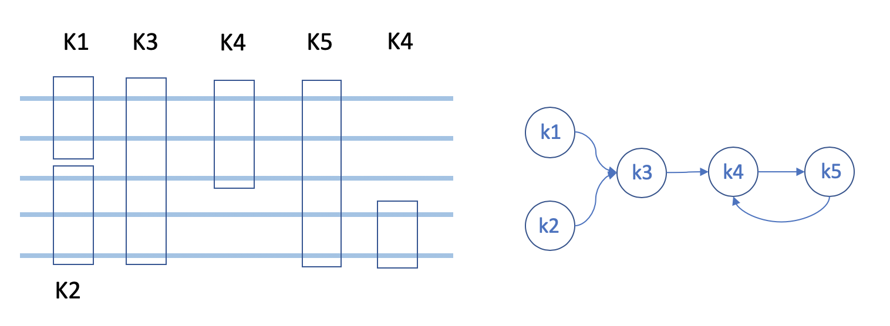

# SWIGG - SWIft Genomes in a Graph

A pipeline for making SWIft Genomes in a Graph (SWIGG) using k-mers. We follow a multiscale approach to build genome graphs in an hierarchial way.

</a>
      

## Abstract
An automated pipeline to build graphs quick using kmer approach.
There are several sequences across human genome, viruses and also among other species that are known to have **conserved** and **variable** regions. These regions of are interest to the scientific community because of its dynamic characteristics. We want to be able to build graphs using alternative references that are representative of sequence of interest and also **fast**.

Building graphs for genomes, or large genomic regions is computationally very expensive and so we can use a multi-scale approach to build genome graphs in an hierarchial way. The idea is to create a sparse representation for multiple sequence alignment so we can visualize large scale difference such as stuctural variants in a succinct way. By representing a genome with graphs, we can create an anchor graph, which can then be further iteratively improved to include local sequence differences and possibly help us with genotyping and identifying true variants.

_**SWIGG**_ is a fast an efficient tool that can do this. The following is a graph created using SWIGG in less than three minutes that use 128-mers and builds on seven alternative references of MHC region (4.5Mb in size)

 
Fig: Genome graph built using 128-mers and seven alternative contigs of MHC gene

## Objective 

The primary objective is to build an open-source platorm tool that builds a genome graph by eluding the use of massive amounts of compute and/or advanced algorithms.

We can construct graph genomes of a small portion of the genome that can still lead to interesting insights and can be built, rendered, and analyzed using **memory and compute power equivalent to that of a local-CPU.**  We also want to be able to use **publicly accessible, easy-to-obtain data.**

## Getting Started

### Meet the Software Requirements OR Docker
#### Software Requirements
- Python 3.7
  - numpy (1.16.4)
  - pandas (0.24.2)
  - biopython (1.74)
  - argparse
  - collections
- Gephi
#### Docker
- Alternatively, the following docker image can be used
Follow the **simple three step process** to **build and visualize** beautiful graphs using a list of fasta sequences. For our example, we use a region known to have high variation across humans - the MHC gene region which is 4.5Mb in size and known ot have conserved and variable regions.

### Download Test Data
For test data, we will download and process seven alternative contigs of MHC sequences available from the GRCh38 genome.
- Add Reference of dataset download

### Build and Render Graphs
We used Gephi to visualize this edge list that was created by . We use the ??? settings, which optimizes graphs like this for human visualization

## Methods

### Initial Algorithm Idea: K-mers

## Future Direction

1. Many k-mers happen to be adjacent to each other, which actually is just one large k-mer. We would like to merge these small k-mers to a merge larger k-mers.
2. We would also like to further improve the graph by iterating over local sequences
3. 

## Other Graphs constructed
This following are other graphs created using different set of parameters

  
Fig: Graph for MHC region with 31-mers where k-mers are present in at least 5/7 alternative contigs.

  
Fig: Graph for HIV viral genome (10kb) for ten genomes using 10-mers.

## Understanding new sequences from the model.

We would like to be able to use this graph model to be able to analyze a new sequence, and understand where it's structural variation occurs (ie which "path" on the graph it follows"). 
