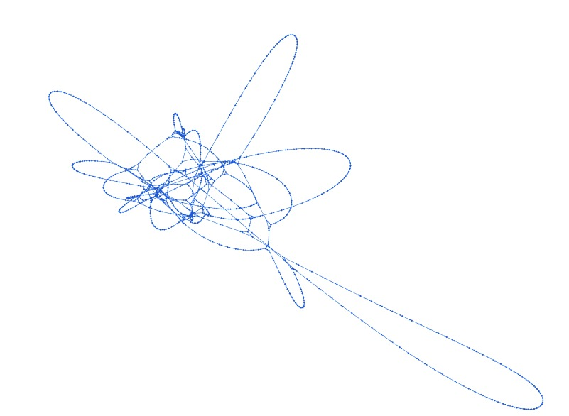
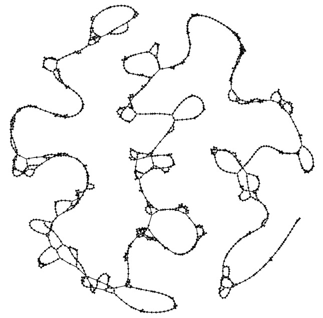
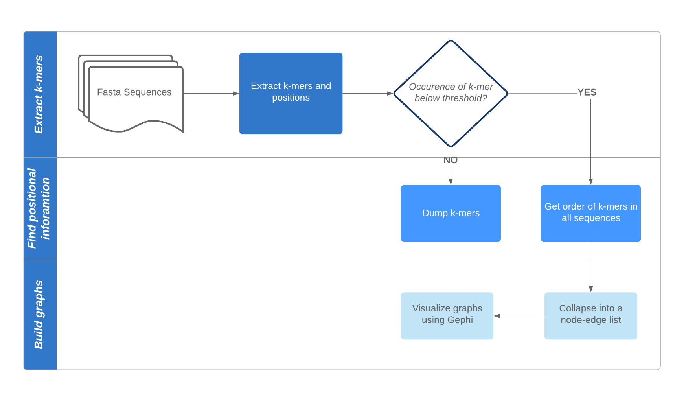
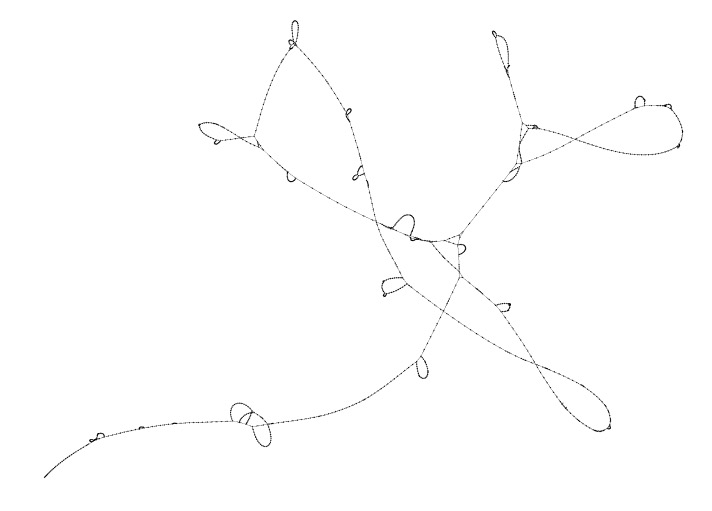

# SWIGG - SWIft Genomes in a Graph

A pipeline for making SWIft Genomes in a Graph (SWIGG) using k-mers. We follow a multiscale approach to build genome graphs in a hierarchial way.

</a>
      

## Abstract
An automated pipeline to build graphs quickly using kmer approach.
There are regions across the human genome that are **conserved** among species while bearing modest amount of **varability**. The dynamic characteristics of these regions are suitable for understanding relationships of genome structure among individuals and/or organisms. Such relationships are best represented with grpahs. Building graphs for genomes, or large genomic regions is computationally  expensive. Using a multi-scale approach we creat a simple algorithm and tool to build genome graphs **fast**.

This approach captures variations in an hierarchial way. The idea is to create a sparse representation of large scale differences (anchors) so as to allow visualizing the entire genome in a succinct way. These "anchored" graphs can then be further iteratively improved to include local sequence differences, and in turn, helps us with genotyping existing variants and identifying new variants in new genomes.

_**SWIGG**_ is a fast an efficient tool that can do this. The following is a graph created using SWIGG in less than three minutes that uses 128-mers and builds on seven alternative haplotypes of the human MHC region (4.5Mb in size)

 
Fig: Genome graph built using 128-mers and seven alternative contigs of MHC gene

## Objective 

The primary objective is to build an open-source platorm tool that builds a genome graph by eluding the use of massive amounts of compute and/or advanced algorithms.

We can construct graph genomes of a small portion of the genome that can still lead to interesting insights and can be built, rendered, and analyzed using **memory and compute power equivalent to that of a local-CPU.**  We also want to be able to use **publicly accessible, easy-to-obtain data.**

## Getting Started
Follow the simple three step process to build and visualize amazing graphs
### Download Test Data
For test data, we will download and process seven alternative contigs of MHC sequences available from the GRCh38 genome.
- Add Reference of dataset download
### Requirements
- Python 3.7

### Build Graphs
- Alternatively, the following docker image and CWLTool can be used
Running command (CWL, Docker Image, etc.)

## Methods

### Initial Algorithm Idea: K-mers

### Graph Rendering

We used Gephi to visualize this graph. We use the ??? settings, which optimizes graphs like this for human vi,Here are some examples below (MHC region subsampled, HIV)

## Future Direction

1. Many k-mers happen to be adjacent to each other, which actually is just one large k-mer. We would like to merge these small k-mers to a merge larger k-mers.
2. We would also like to further improve the graph by iterating over local sequences
3. 

### Graph Rendering

## Other Graphs constructed
This work can then be extrapolated to 

  

  

### Understanding new sequences from the model.

We would like to be able to use this graph model to be able to analyze a new sequence, and understand where it's structural variation occurs (ie which "path" on the graph it follows"). 
